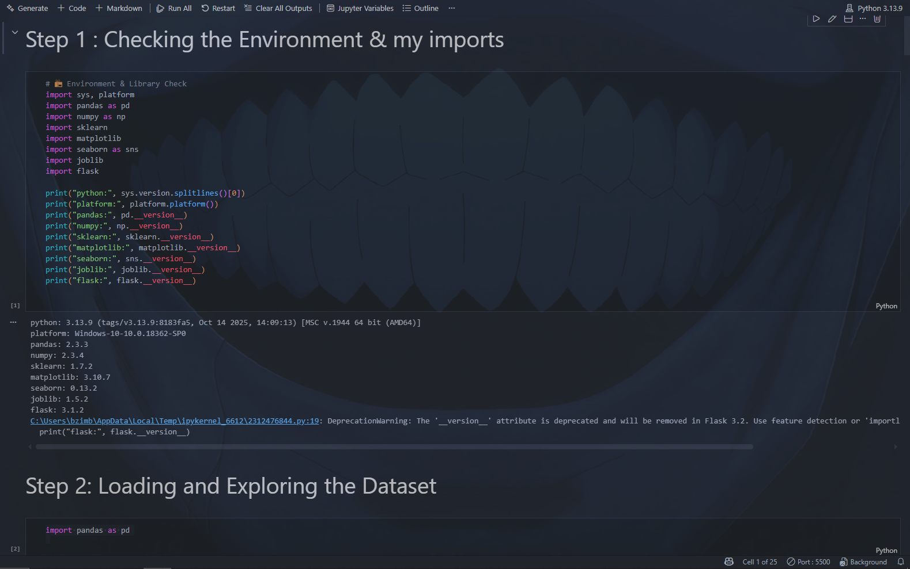
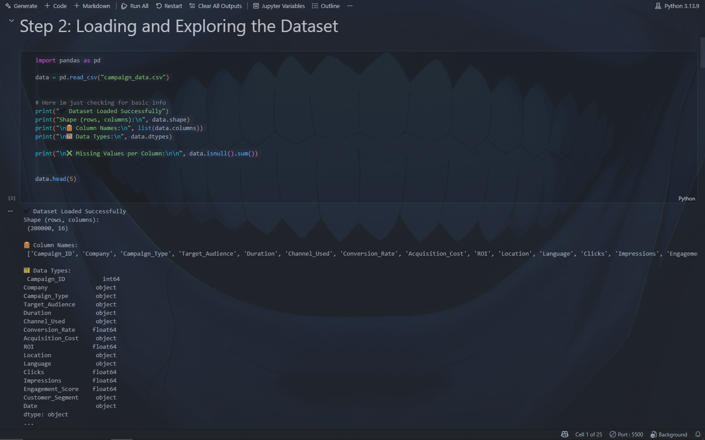
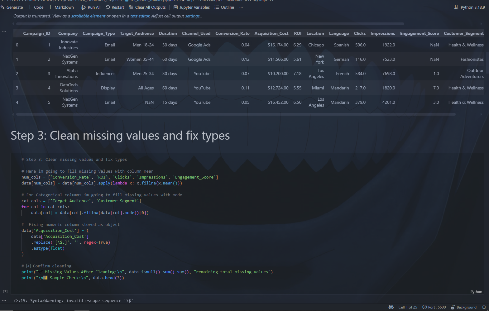
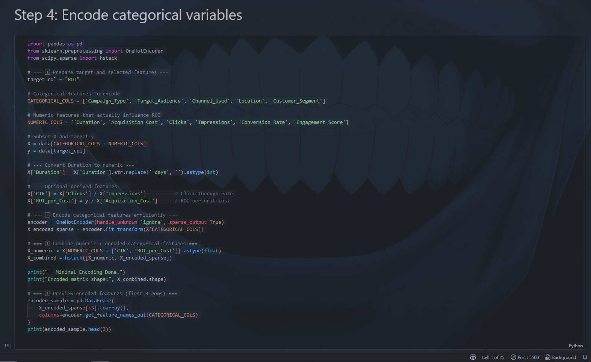
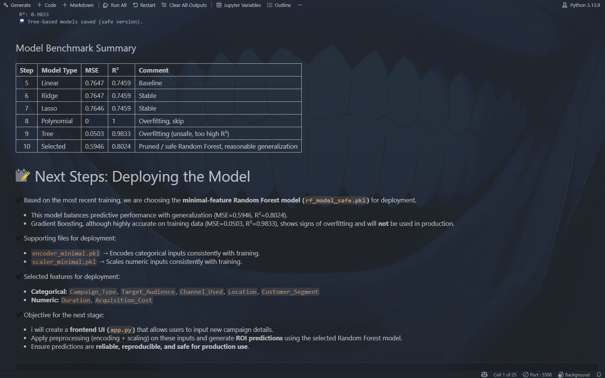
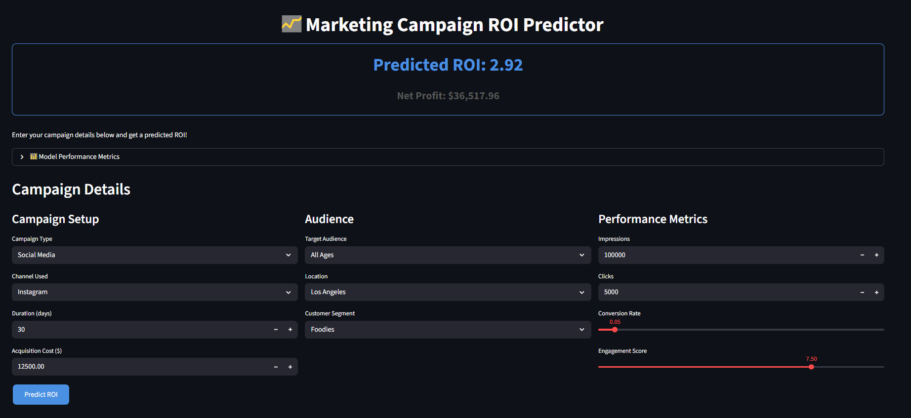

## Project Overview

This is a **Return on Investment (ROI) Prediction Model** built in Python. The goal is to help marketers and analysts estimate the ROI of marketing campaigns by learning from historical campaign data — including clicks, impressions, acquisition costs, engagement scores, conversion rates, and more. The model is cleaned, engineered, scaled, and trained using linear regression, ridge, and lasso approaches. Finally, it’s saved and deployed through Flask to make real-time predictions accessible.

---

## Motivation

Marketing campaigns often incur significant costs, and decision-makers want to know whether a campaign will pay off ahead of time. By predicting ROI, this tool gives teams actionable insight before running major campaigns, potentially saving budget and increasing efficiency.

---

## Data & Preprocessing

First, the raw campaign data (from `campaign_data.csv`) is loaded and explored. Missing values in numeric columns (such as conversion rate, clicks, impressions, ROI) are filled with column means. Categorical variables like “Customer Segment” and “Target Audience” are filled with their most frequent category.

Key numeric features are cleaned and converted, for example converting “Duration” from a string like “30 days” into an integer. Then, two derived features are created:
- **CTR (Click-Through Rate)**: Clicks divided by Impressions  
- **ROI per Cost**: ROI divided by Acquisition Cost  

These new features help the model better understand campaign efficiency and performance.

Next, categorical features (`Campaign_Type`, `Target_Audience`, `Channel_Used`, `Location`, `Customer_Segment`) are one-hot encoded so they can be used in the regression model along with numeric features.

---

## Model Training & Evaluation

After encoding, the data is split into training and testing sets. Numeric features are scaled (standardized) to ensure that small-scale and large-scale variables contribute fairly to the model.

The core model is a **Linear Regression**, which serves as a baseline. Its performance is evaluated using **Mean Squared Error (MSE)** and **R²**, providing insight into how well the model predicts ROI and how much of the variance in ROI is explained.

To improve generalization and prevent overfitting, **Ridge** and **Lasso Regression** are also trained and evaluated. These models apply regularization to reduce large coefficients and (in the case of Lasso) automatically drop less important features by driving some weights to zero.

---

## Deployment & Serialization

Once trained, the best-performing components — including the regression model, the scaler, and the encoder — are **serialized and saved** using `joblib` (saved as `.pkl` files). These artifacts are then loaded in a **Flask web app**, which provides a simple interface to input new campaign details and receive ROI predictions in real time.

This deployment setup makes the model accessible and useful for stakeholders who may not be familiar with code or machine learning.

---

## Results & Insights

- Derived features (like CTR and ROI-per-cost) significantly improved model performance.  
- Regularized models offered better stability and less overfitting.  
- Validation metrics (MSE, R²) show that the model captures meaningful relationships in the data.  
- The Flask app demonstrates how this predictive pipeline can be used in real-world campaign planning.

---

## Next Steps / Future Work

- Extend the model with **non-linear models** (e.g. Gradient Boosting or Neural Networks) to improve prediction accuracy.  
- Add more sophisticated feature engineering (interaction terms, temporal features, etc.).  
- Introduce **hyperparameter tuning** with cross-validation (e.g. `GridSearchCV`) for Ridge, Lasso, and other models.  
- Build a polished frontend (e.g. using Streamlit, React) to make the app more user-friendly.  
- Set up automated retraining when new campaign data becomes available, so predictions improve over time.

---

## Images / Visuals

Below are visual summaries of key project stages:

- `1.png` – Data exploration & summary  
- `2.png` –   
- `3.png` – 
- `4.png` – 
- `5.png` – Model training results (MSE & R² comparison)  
- `6.png` – Screenshot of Streamlit prediction UI

  
  
  
  
  

---

## License

This project is licensed under the MIT License. See the `LICENSE` file in the repository for more details.  
